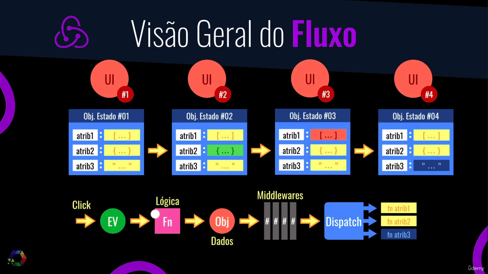
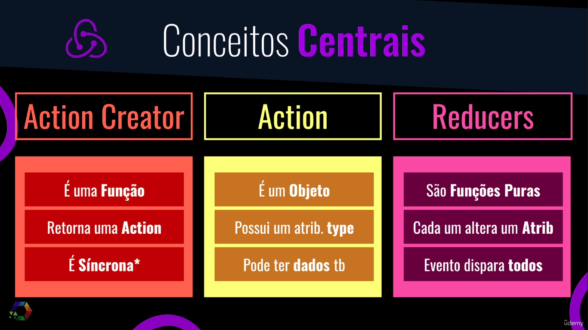
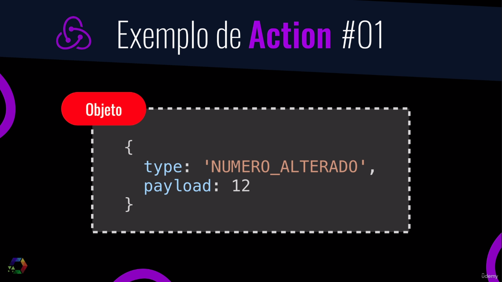
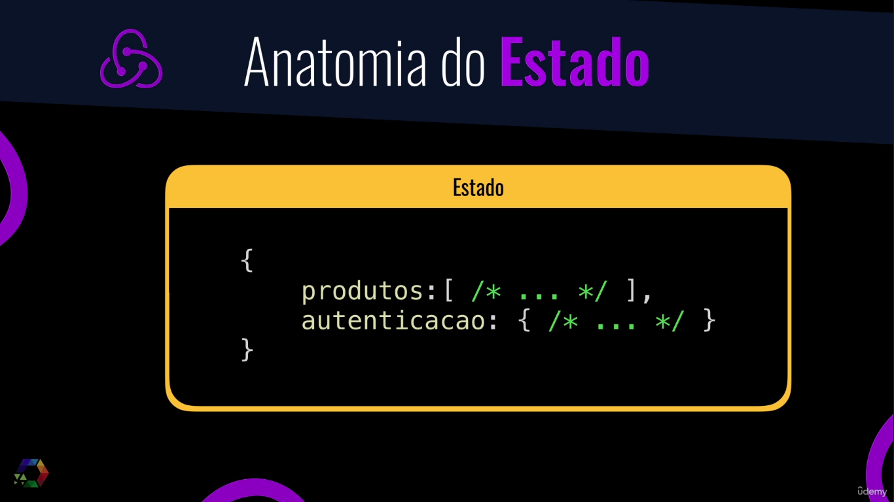
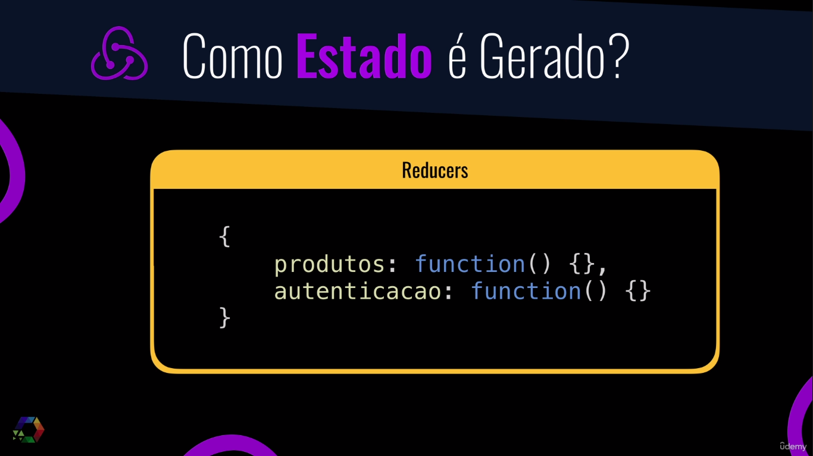
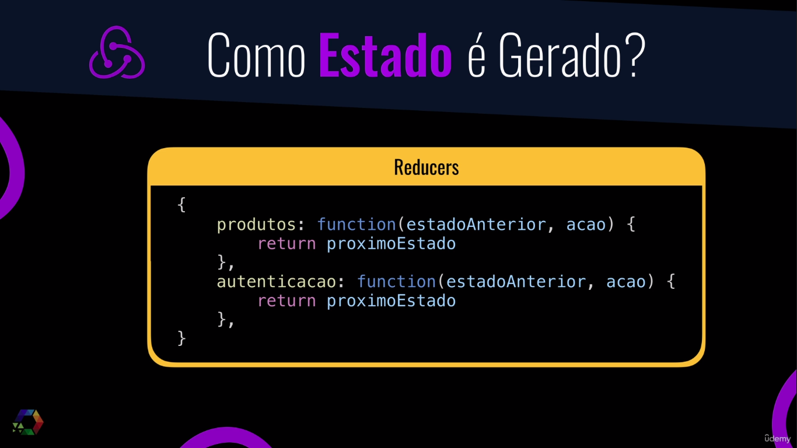
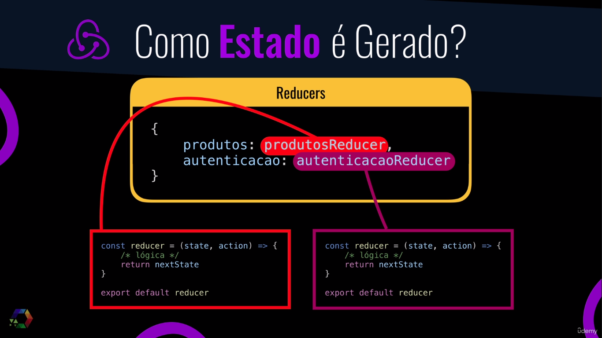
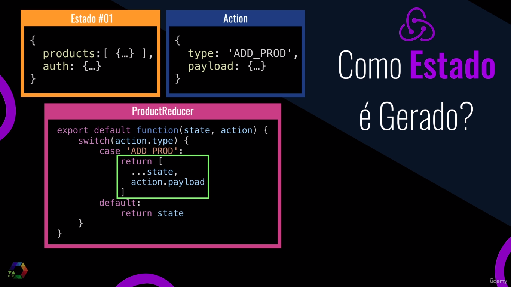
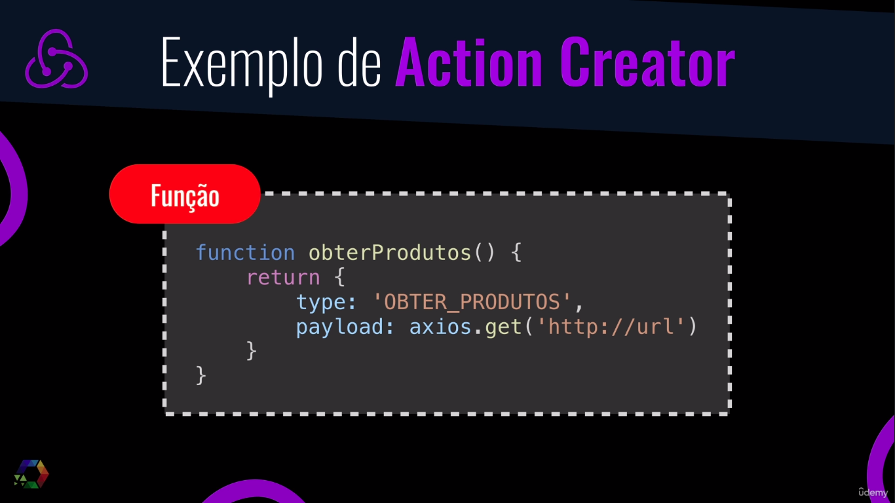
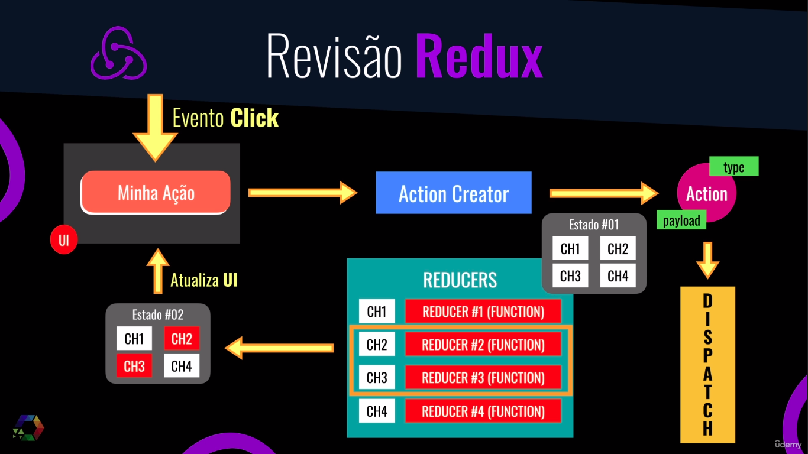

# Gerenciamento de Estado com `Redux`

___

## Conceitos Centrais

___
## Anatomia da `Action`

___

## Exemplo de `Action`

___

## Anatomia do `Action Creator`

___

## Anatomia do `estado`

___

## Como o `Estado` é Gerado

___

## Exemplo de `Action Creator`

___

## Revisão

___

